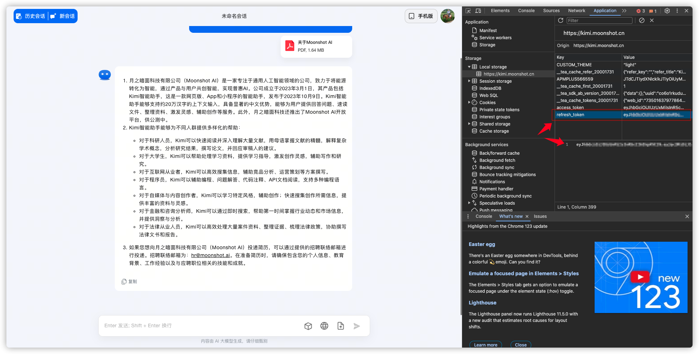
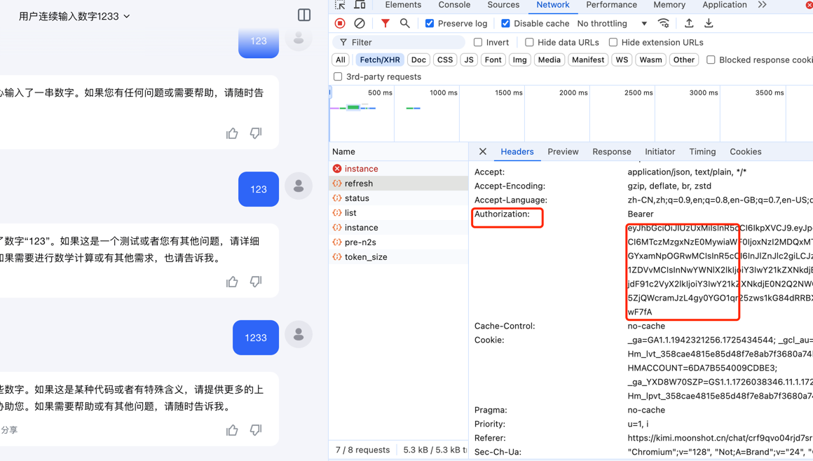
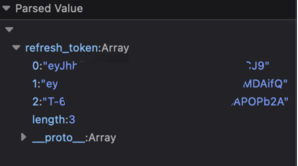

# KIMI AI Free 服务


<hr>

<span>[ 中文 | <a href="README_EN.md">English</a> ]</span>


[](LICENSE)


支持高速流式输出、支持多轮对话、支持联网搜索、支持智能体对话、支持长文档解读、支持图像OCR，零配置部署，多路token支持，自动清理会话痕迹。

与ChatGPT接口完全兼容。

还有以下八个free-api欢迎关注：


### 支持的 AI

| AI 机器人                                                                         | API  | 文件上传  | 说明                                      |
|--------------------------------------------------------------------------------|------|-------|-----------------------------------------|
| [360 智脑](https://ai.360.cn/)                                                   | 支持   | 无     | todo                                    |
| [Character.AI](https://character.ai/)                                          | 支持   | 无     | todo                                    |
| [智谱清言(ChatGLM)](https://chatglm.cn/)                                           | 支持   | 无 API |                                         |
| [ChatGPT](https://chat.openai.com)                                             | 支持   | 支持    | 包含 Web Browsing、Azure OpenAI service    |
| [Claude](https://www.anthropic.com/claude)                                     | 支持   | 支持    | todo                                    |
| [Code Llama](https://ai.meta.com/blog/code-llama-large-language-model-coding/) | 支持   | 无 API | todo                                    |
| [Copilot](https://copilot.microsoft.com/)                                      | 支持   | 无 API | todo                                    |
| [得到学习助手](https://ai.dedao.cn/)                                                 | 即将推出 | 无 API | todo                                    |
| [Falcon 180B](https://huggingface.co/tiiuae/falcon-180B-chat)                  | 支持   | 无 API | todo                                    |
| [Gemini](https://gemini.google.com/)                                           | 支持   | 支持    | todo                                    |
| [Gemma 2B & 7B](https://blog.google/technology/developers/gemma-open-models/)  | 支持   | 无     | todo                                    |
| [Gradio](https://gradio.app/)                                                  | 支持   | 无 API | 用于 Hugging Face space 或自己部署的模型     todo |
| [HuggingChat](https://huggingface.co/chat/)                                    | 支持   | 无 API | todo                                    |
| [讯飞星火](http://xinghuo.xfyun.cn/)                                               | 支持   | 即将推出  |                                         |
| [月之暗面-Kimi](https://kimi.moonshot.cn/)                                         | 支持   | 无 API |                                         |
| [Llama 2 13B 和 70B](https://ai.meta.com/llama/)                                | 支持   | 无 API | todo                                    |
| [MOSS](https://moss.fastnlp.top/)                                              | 支持   | 无 API | todo                                    |
| [Perplexity](https://www.perplexity.ai/)                                       | 支持   | 无     | todo                                    |
| [Phind](https://www.phind.com/)                                                | 支持   | 无 API | todo                                    |
| [Pi](https://pi.ai)                                                            | 支持   | 无 API | todo                                    |
| [Poe](https://poe.com/)                                                        | 支持   | 即将推出  | todo                                    |
| [天工](https://neice.tiangong.cn/)                                               | 支持   | 即将推出  | todo                                    |
| [通义千问](http://tongyi.aliyun.com/)                                              | 支持   | 即将推出  | todo                                    |
| [Vicuna 13B 和 33B](https://lmsys.org/blog/2023-03-30-vicuna/)                  | 支持   | 无 API | 不需要帐号           todo                    |
| [WizardLM 70B](https://github.com/nlpxucan/WizardLM)                           | 支持   | 无 API | todo                                    |
| [YouChat](https://you.com/)                                                    | 支持   | 无     | todo                                    |
| [You](https://you.com/)                                                        | 支持   | 无 API | todo                                    |
| [Zephyr](https://huggingface.co/spaces/HuggingFaceH4/zephyr-chat)              | 支持   | 无     | todo                                    |
| [Mistral]()             | 支持   | 无     | todo                                    |
| [秘塔AI (Metaso)]()             | 支持   | 无     | todo                                    |
| [MiniMax（海螺AI）]()             | 支持   | 无     | todo                                    |
| [深度求索（DeepSeek）]()             | 支持   | 无     | todo                                    |
| [聆心智能 (Emohaa)]()             | 支持   | 无     | todo                                    |
| [阶跃星辰 (跃问StepChat)]()             | 支持   | 无     | todo                                    |


## 目录

* [免责声明](#免责声明)
* [在线体验](#在线体验)
* [效果示例](#效果示例)
* [接入准备](#接入准备)
  * [多账号接入](#多账号接入)
* [Docker部署](#Docker部署)
  * [Docker-compose部署](#Docker-compose部署)
* [Render部署](#Render部署)
* [Vercel部署](#Vercel部署)
* [Zeabur部署](#Zeabur部署)
* [原生部署](#原生部署)
* [推荐使用客户端](#推荐使用客户端)
* [接口列表](#接口列表)
  * [对话补全](#对话补全)
  * [文档解读](#文档解读)
  * [图像解析](#图像解析)
  * [refresh_token存活检测](#refresh_token存活检测)
* [注意事项](#注意事项)
  * [Nginx反代优化](#Nginx反代优化)
  * [Token统计](#Token统计)
* [Star History](#star-history)

## 免责声明

**逆向API是不稳定的，建议前往官方付费使用API，避免封禁的风险。**

**本组织和个人不接受任何资金捐助和交易，此项目是纯粹研究交流学习性质！**

**仅限自用，禁止对外提供服务或商用，避免对官方造成服务压力，否则风险自担！**

**仅限自用，禁止对外提供服务或商用，避免对官方造成服务压力，否则风险自担！**

**仅限自用，禁止对外提供服务或商用，避免对官方造成服务压力，否则风险自担！**

## 在线体验

此链接仅临时测试功能，不可长期使用，长期使用请自行部署。

[](https://gitpod.io/#https://github.com/shengdingbox/aibotgo)


## 效果示例

### 验明正身Demo


### 多轮对话Demo


### 联网搜索Demo


### 智能体对话Demo

此处使用 [翻译通](https://kimi.moonshot.cn/chat/coo6l3pkqq4ri39f36bg) 智能体。


### 长文档解读Demo


### 图像OCR Demo


### 响应流畅度一致


## 接入准备
### kimi

从 [kimi.moonshot.cn](https://kimi.moonshot.cn) 获取refresh_token

进入kimi随便发起一个对话，然后F12打开开发者工具，从Application > Local Storage中找到`refresh_token`的值，这将作为Authorization的Bearer Token值：`Authorization: Bearer TOKEN`



或者是随便发送一个请求，查看请求头中的Authorization字段：



注意：refresh_token可能为空，此时请使用`Authorization: Bearer `空格后直接输入` `。

如果你看到的`refresh_token`是一个数组，请使用`.`拼接起来再使用。



## 多账号接入

目前kimi限制普通账号每3小时内只能进行30轮长文本的问答（短文本不限），你可以通过提供多个账号的refresh_token并使用`,`拼接提供：

`Authorization: Bearer TOKEN1,TOKEN2,TOKEN3`

每次请求服务会从中挑选一个。

## Docker部署

请准备一台具有公网IP的服务器并将8000端口开放。

拉取镜像并启动服务

```shell
docker build . -t aibotgo:0.0.1
docker run -it -d --init --name aibotgo -p 9999:9999 -e TZ=Asia/Shanghai aibotgo:0.0.1
```

查看服务实时日志

```shell
docker logs -f aibotgo
```

重启服务

```shell
docker restart aibotgo
```

停止服务

```shell
docker stop aibotgo
```

### Docker-compose部署

```yaml
version: '3'

services:
  aibotgo:
    container_name: aibotgo
    image: shengdingbox/aibotgo:latest
    restart: always
    ports:
      - "9999:9999"
    environment:
      - TZ=Asia/Shanghai
```

### 云容器部署
**注意：免费账户的容器实例可能无法稳定运行**
#### gitpod
[](https://gitpod.io/#https://github.com/shengdingbox/aibotgo)


## 原生部署

请准备一台具有公网IP的服务器并将9999端口开放。

请先安装好java环境并且配置好环境变量，确认命令可用。

打包

```shell
mvn clean package -Dmaven.test.skip=true
```

jar包启动

```shell
cd ./target
nohup java -jar -Xms768m -Xmx1024m -XX:+HeapDumpOnOutOfMemoryError aibotgo-0.0.1-SNAPSHOT.jar  dev/null 2>&1 &
```

查看服务实时日志

```shell
cd ${user.home}/logs/aibotgo
tail -f  app.log
```

## 推荐使用客户端

使用以下二次开发客户端接入free-api系列项目更快更简单，支持文档/图像上传！

由 [Clivia](https://github.com/Yanyutin753/lobe-chat) 二次开发的LobeChat [https://github.com/Yanyutin753/lobe-chat](https://github.com/Yanyutin753/lobe-chat)

由 [时光@](https://github.com/SuYxh) 二次开发的ChatGPT Web [https://github.com/SuYxh/chatgpt-web-sea](https://github.com/SuYxh/chatgpt-web-sea)

## 接口列表

目前支持与openai兼容的 `/v1/chat/completions` 接口，可自行使用与openai或其他兼容的客户端接入接口，或者使用 [dify](https://dify.ai/) 等线上服务接入使用。

### 对话补全

对话补全接口，与openai的 [chat-completions-api](https://platform.openai.com/docs/guides/text-generation/chat-completions-api) 兼容。

**POST /v1/chat/completions**

header 需要设置 Authorization 头部：

```
Authorization: Bearer [refresh_token]
```

请求数据：
```json
{
    // model随意填写，如果不希望输出检索过程模型名称请包含silent_search
    // 如果使用kimi+智能体，model请填写智能体ID，就是浏览器地址栏上尾部的一串英文+数字20个字符的ID
    "model": "kimi",
    // 目前多轮对话基于消息合并实现，某些场景可能导致能力下降且受单轮最大Token数限制
    // 如果您想获得原生的多轮对话体验，可以传入首轮消息获得的id，来接续上下文，注意如果使用这个，首轮必须传none，否则第二轮会空响应！
    // "conversation_id": "cnndivilnl96vah411dg",
    "messages": [
        {
            "role": "user",
            "content": "测试"
        }
    ],
    // 是否开启联网搜索，默认false
    "use_search": true,
    // 如果使用SSE流请设置为true，默认false
    "stream": false
}
```

响应数据：
```json
{
    // 如果想获得原生多轮对话体验，此id，你可以传入到下一轮对话的conversation_id来接续上下文
    "id": "cnndivilnl96vah411dg",
    "model": "kimi",
    "object": "chat.completion",
    "choices": [
        {
            "index": 0,
            "message": {
                "role": "assistant",
                "content": "你好！我是Kimi，由月之暗面科技有限公司开发的人工智能助手。我擅长中英文对话，可以帮助你获取信息、解答疑问，还能阅读和理解你提供的文件和网页内容。如果你有任何问题或需要帮助，随时告诉我！"
            },
            "finish_reason": "stop"
        }
    ],
    "usage": {
        "prompt_tokens": 1,
        "completion_tokens": 1,
        "total_tokens": 2
    },
    "created": 1710152062
}
```

### 文档解读

提供一个可访问的文件URL或者BASE64_URL进行解析。

**POST /v1/chat/completions**

header 需要设置 Authorization 头部：

```
Authorization: Bearer [refresh_token]
```

请求数据：
```json
{
    // 模型名称随意填写，如果不希望输出检索过程模型名称请包含silent_search
    "model": "kimi",
    "messages": [
        {
            "role": "user",
            "content": [
                {
                    "type": "file",
                    "file_url": {
                        "url": "https://mj101-1317487292.cos.ap-shanghai.myqcloud.com/ai/test.pdf"
                    }
                },
                {
                    "type": "text",
                    "text": "文档里说了什么？"
                }
            ]
        }
    ],
    // 建议关闭联网搜索，防止干扰解读结果
    "use_search": false
}
```

响应数据：
```json
{
    "id": "cnmuo7mcp7f9hjcmihn0",
    "model": "kimi",
    "object": "chat.completion",
    "choices": [
        {
            "index": 0,
            "message": {
                "role": "assistant",
                "content": "文档中包含了几个古代魔法咒语的例子，这些咒语来自古希腊和罗马时期的魔法文本，被称为PGM（Papyri Graecae Magicae）。以下是文档中提到的几个咒语的内容：\n\n1. 第一个咒语（PMG 4.1390 – 1495）描述了一个仪式，要求留下一些你吃剩的面包，将其分成七块小片，然后去到英雄、角斗士和那些死于非命的人被杀的地方。对面包片念咒并扔出去，然后从仪式地点捡起一些被污染的泥土扔进你心仪的女人的家中，之后去睡觉。咒语的内容是向命运女神（Moirai）、罗马的命运女神（Fates）和自然力量（Daemons）祈求，希望他们帮助实现愿望。\n\n2. 第二个咒语（PMG 4.1342 – 57）是一个召唤咒语，通过念出一系列神秘的名字和词语来召唤一个名为Daemon的存在，以使一个名为Tereous的人（由Apia所生）受到精神和情感上的折磨，直到她来到施法者Didymos（由Taipiam所生）的身边。\n\n3. 第三个咒语（PGM 4.1265 – 74）提到了一个名为NEPHERIĒRI的神秘名字，这个名字与爱神阿佛洛狄忒（Aphrodite）有关。为了赢得一个美丽女人的心，需要保持三天的纯洁，献上乳香，并在献祭时念出这个名字。然后，在接近那位女士时，心中默念这个名字七次，连续七天这样做，以期成功。\n\n4. 第四个咒语（PGM 4.1496 – 1）描述了在燃烧没药（myrrh）时念诵的咒语。这个咒语是向没药祈祷，希望它能够像“肉食者”和“心灵点燃者”一样，吸引一个名为[名字]的女人（她的母亲名为[名字]），让她无法安坐、饮食、注视或亲吻其他人，而是让她的心中只有施法者，直到她来到施法者身边。\n\n这些咒语反映了古代人们对魔法和超自然力量的信仰，以及他们试图通过这些咒语来影响他人情感和行为的方式。"
            },
            "finish_reason": "stop"
        }
    ],
    "usage": {
        "prompt_tokens": 1,
        "completion_tokens": 1,
        "total_tokens": 2
    },
    "created": 100920
}
```

### 图像OCR

提供一个可访问的图像URL或者BASE64_URL进行解析。

此格式兼容 [gpt-4-vision-preview](https://platform.openai.com/docs/guides/vision) API格式，您也可以用这个格式传送文档进行解析。

**POST /v1/chat/completions**

header 需要设置 Authorization 头部：

```
Authorization: Bearer [refresh_token]
```

请求数据：
```json
{
    // 模型名称随意填写，如果不希望输出检索过程模型名称请包含silent_search
    "model": "kimi",
    "messages": [
        {
            "role": "user",
            "content": [
                {
                    "type": "image_url",
                    "image_url": {
                        "url": "https://www.moonshot.cn/assets/logo/normal-dark.png"
                    }
                },
                {
                    "type": "text",
                    "text": "图像描述了什么？"
                }
            ]
        }
    ],
    // 建议关闭联网搜索，防止干扰解读结果
    "use_search": false
}
```

响应数据：
```json
{
    "id": "cnn6l8ilnl92l36tu8ag",
    "model": "kimi",
    "object": "chat.completion",
    "choices": [
        {
            "index": 0,
            "message": {
                "role": "assistant",
                "content": "图像中展示了“Moonshot AI”的字样，这可能是月之暗面科技有限公司（Moonshot AI）的标志或者品牌标识。通常这样的图像用于代表公司或产品，传达品牌信息。由于图像是PNG格式，它可能是一个透明背景的logo，用于网站、应用程序或其他视觉材料中。"
            },
            "finish_reason": "stop"
        }
    ],
    "usage": {
        "prompt_tokens": 1,
        "completion_tokens": 1,
        "total_tokens": 2
    },
    "created": 1710123627
}
```

### refresh_token存活检测

检测refresh_token是否存活，如果存活live为true，否则为false，请不要频繁（小于10分钟）调用此接口。

**POST /token/check**

请求数据：
```json
{
    "token": "eyJhbGciOiJIUzUxMiIsInR5cCI6IkpXVCJ9..."
}
```

响应数据：
```json
{
    "live": true
}
```

## 注意事项

### Nginx反代优化

如果您正在使用Nginx反向代理kimi-free-api，请添加以下配置项优化流的输出效果，优化体验感。

```nginx
# 关闭代理缓冲。当设置为off时，Nginx会立即将客户端请求发送到后端服务器，并立即将从后端服务器接收到的响应发送回客户端。
proxy_buffering off;
# 启用分块传输编码。分块传输编码允许服务器为动态生成的内容分块发送数据，而不需要预先知道内容的大小。
chunked_transfer_encoding on;
# 开启TCP_NOPUSH，这告诉Nginx在数据包发送到客户端之前，尽可能地发送数据。这通常在sendfile使用时配合使用，可以提高网络效率。
tcp_nopush on;
# 开启TCP_NODELAY，这告诉Nginx不延迟发送数据，立即发送小数据包。在某些情况下，这可以减少网络的延迟。
tcp_nodelay on;
# 设置保持连接的超时时间，这里设置为120秒。如果在这段时间内，客户端和服务器之间没有进一步的通信，连接将被关闭。
keepalive_timeout 120;
```

### Token统计

由于推理侧不在kimi-free-api，因此token不可统计，将以固定数字返回!!!!!

## Star History

[](https://star-history.com/#shengdingbox/aibotgo&Date)
